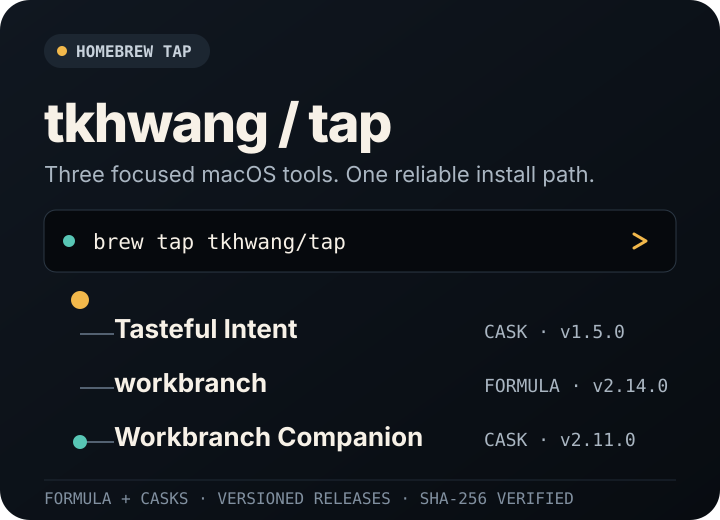

<h1 align="center">tkhwang Homebrew Tap</h1>

<p align="center">
  
</p>

<p align="center">
  <strong>One tap. Three focused tools.</strong><br>
  Install the latest releases of Tasteful Intent, workbranch, and Workbranch Companion with Homebrew.
</p>

## Install

Pick the tool you need. A fully qualified install command adds this tap automatically.

### Tasteful Intent

A Markdown memo editor for shaping intent and taste. Available for Apple Silicon and Intel Macs.

```bash
brew install --cask tkhwang/tap/tasteful-intent
```

[View Tasteful Intent →](https://github.com/tkhwang/tasteful-intent)

### workbranch

A CLI that simplifies task-oriented Git worktree workspaces and branch operations.

```bash
brew install tkhwang/tap/workbranch
```

[View workbranch →](https://github.com/tkhwang/workbranch)

### Workbranch Companion

A menu bar companion for the `workbranch` CLI. Requires macOS Ventura or later.

```bash
brew install --cask tkhwang/tap/workbranch-companion
```

[View Workbranch Companion →](https://github.com/tkhwang/workbranch)

## What's in the tap

| Package | Kind | Current version | Definition |
| --- | --- | ---: | --- |
| `tasteful-intent` | Cask | `1.5.0` | [`Casks/tasteful-intent.rb`](./Casks/tasteful-intent.rb) |
| `workbranch` | Formula | `2.14.0` | [`Formula/workbranch.rb`](./Formula/workbranch.rb) |
| `workbranch-companion` | Cask | `2.11.0` | [`Casks/workbranch-companion.rb`](./Casks/workbranch-companion.rb) |

## Update or remove

Upgrade any installed package:

```bash
brew update
brew upgrade tasteful-intent workbranch workbranch-companion
```

Remove packages you no longer need:

```bash
brew uninstall --cask tasteful-intent
brew uninstall workbranch
brew uninstall --cask workbranch-companion
```

<details>
<summary><strong>Migrating from the legacy <code>intent-memo</code> cask</strong></summary>

The renamed cask needs a fresh Homebrew receipt. Remove the legacy cask, then install Tasteful Intent:

```bash
brew uninstall --cask intent-memo
brew install --cask --force tkhwang/tap/tasteful-intent
```

</details>

## How releases arrive here

The upstream release workflows update each Formula or Cask with its published artifact URL, version, and SHA-256 checksum. Homebrew then installs the release directly from its source repository.

- `Formula/workbranch.rb` builds the tagged CLI source with `apps/cli/scripts/build-workbranch.sh`.
- `Casks/tasteful-intent.rb` installs `TastefulIntent.app`.
- `Casks/workbranch-companion.rb` installs `WorkbranchCompanion.app`.

## License

Each package is distributed under the license declared by its upstream project.
